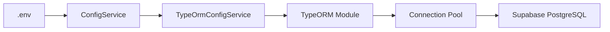

# Supabase Database Setup

## Overview

This project is now configured to connect to Supabase PostgreSQL database. The configuration has been updated to support SSL connections required by Supabase.

## Database Credentials

- **Host**: db.ytdkbqslvnivtdycfwom.supabase.co
- **Port**: 5432
- **Database**: postgres
- **User**: postgres
- **Password**: [Configured in .env]

## Configuration Changes

### Environment Variables (.env)

The following environment variables have been updated to connect to Supabase:

```env
DATABASE_TYPE=postgres
DATABASE_HOST=db.ytdkbqslvnivtdycfwom.supabase.co
DATABASE_PORT=5432
DATABASE_USERNAME=postgres
DATABASE_PASSWORD=HiddupJokowi!!!
DATABASE_NAME=postgres
DATABASE_SYNCHRONIZE=false
DATABASE_MAX_CONNECTIONS=100
DATABASE_SSL_ENABLED=true
DATABASE_REJECT_UNAUTHORIZED=false
DATABASE_CA=
DATABASE_KEY=
DATABASE_CERT=
DATABASE_URL=
```

### Key Configuration Notes

1. **SSL Enabled**: `DATABASE_SSL_ENABLED=true`
   - Supabase requires SSL connections for security

2. **Reject Unauthorized**: `DATABASE_REJECT_UNAUTHORIZED=false`
   - Set to false to accept Supabase's self-signed certificates
   - This is normal for Supabase connections

3. **Database Name**: Changed from `api` to `postgres`
   - Supabase's default database name is `postgres`

4. **Host**: Changed from local `postgres` container to Supabase host
   - Now using cloud-hosted PostgreSQL

## Architecture

### Data Flow

```
Application → TypeORM → SSL/TLS → Supabase PostgreSQL
```

### Configuration Layer

1. `.env` - Environment variables
2. `database.config.ts` - Configuration loader with validation
3. `typeorm-config.service.ts` - TypeORM options builder
4. `data-source.ts` - DataSource for CLI operations

### Connection Flow



## Testing Connection

To test the database connection, run:

```bash
npm run typeorm -- --dataSource=src/database/data-source.ts query "SELECT version();"
```

Expected output:

```
PostgreSQL 17.6 on aarch64-unknown-linux-gnu, compiled by gcc (GCC) 13.2.0, 64-bit
```

## Running Migrations

To run database migrations:

```bash
npm run migration:run
```

To revert migrations:

```bash
npm run migration:revert
```

## Code Changes

**No code changes were required!** The existing codebase already supports:

- SSL connections
- Environment-based configuration
- Both individual connection parameters and connection URL
- Certificate configuration (CA, key, cert)

All configuration is handled through environment variables, following the principles of:

- **12-Factor App**: Configuration in environment
- **DRY**: Single source of truth for database config
- **SOLID**: Dependency on abstractions (ConfigService)

## Security Notes

1. **Never commit `.env` file**: The `.env` file is properly ignored in `.gitignore`
2. **Rotate passwords regularly**: Update database password periodically
3. **Use environment-specific credentials**: Different credentials for dev/staging/prod
4. **Monitor connection pool**: Keep `DATABASE_MAX_CONNECTIONS=100` appropriate for your load

## Troubleshooting

### Error: "self-signed certificate in certificate chain"

**Solution**: Ensure `DATABASE_REJECT_UNAUTHORIZED=false` in `.env`

### Error: Connection timeout

**Solution**:

- Check if Supabase database is running
- Verify host address is correct
- Check network/firewall settings

### Error: Authentication failed

**Solution**:

- Verify username and password in `.env`
- Check Supabase dashboard for correct credentials

## Additional Resources

- [Supabase Documentation](https://supabase.com/docs)
- [TypeORM Documentation](https://typeorm.io/)
- [NestJS Database Guide](https://docs.nestjs.com/techniques/database)

## Principles Applied

✅ **SOLID**: Single Responsibility, Dependency Inversion
✅ **DRY**: Configuration centralized
✅ **KISS**: Simple environment-based configuration
✅ **YAGNI**: No unnecessary features added
