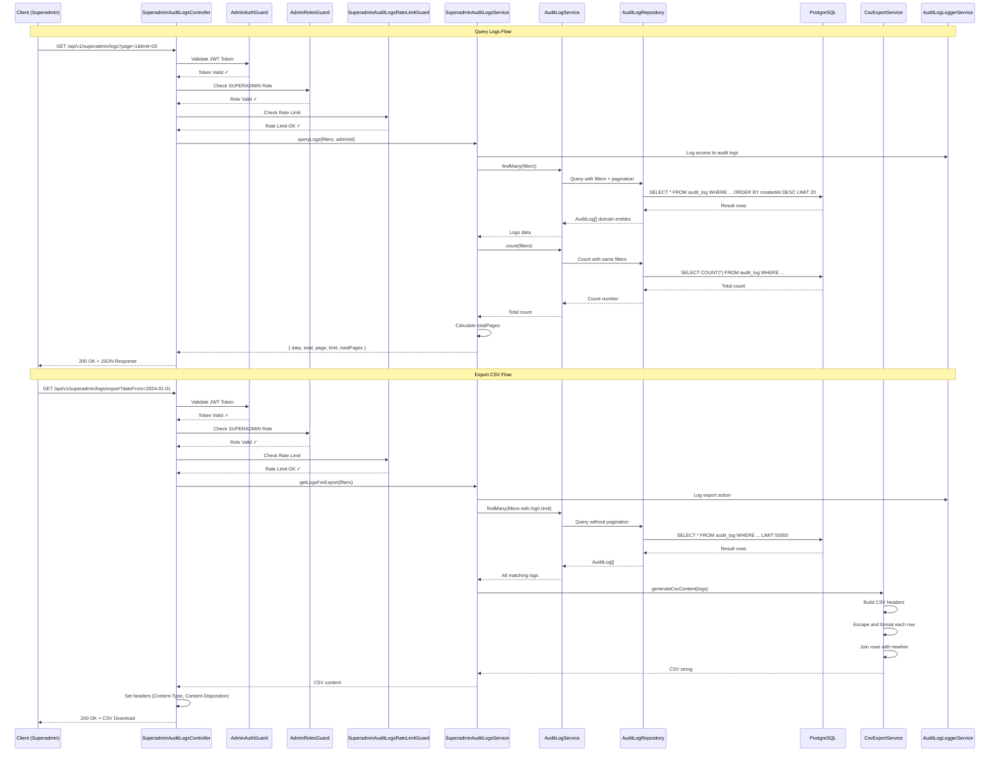

# Superadmin Audit Logs - Data Flow Diagram

## Request Flow Diagram



## Component Architecture Diagram

```
┌─────────────────────────────────────────────────────────────────┐
│                     Superadmin Audit Logs Module                 │
└─────────────────────────────────────────────────────────────────┘
                                  │
                ┌─────────────────┼─────────────────┐
                │                 │                 │
                ▼                 ▼                 ▼
┌──────────────────────┐ ┌──────────────┐ ┌─────────────────────┐
│     Controller       │ │   Service    │ │   CsvExportService  │
│ ─────────────────── │ │ ──────────── │ │ ─────────────────── │
│ - queryLogs()        │ │ - queryLogs()│ │ - generateCsv()     │
│ - exportLogsAsCSV()  │ │ - getForExpt │ │ - escapeCsvValue()  │
└──────────┬───────────┘ └──────┬───────┘ └─────────────────────┘
           │                    │
           │ uses               │ uses
           ▼                    ▼
┌─────────────────────────────────────────┐
│          Guards (Applied to Controller)  │
│ ───────────────────────────────────────│
│ 1. AdminAuthGuard (JWT validation)      │
│ 2. AdminRolesGuard (SUPERADMIN check)   │
│ 3. SuperadminAuditLogsRateLimitGuard    │
└─────────────────────────────────────────┘
           │
           │ uses
           ▼
┌─────────────────────────────────────────┐
│     Existing Modules (Dependencies)      │
│ ───────────────────────────────────────│
│ • AuditLogModule                        │
│   - AuditLogService                     │
│   - AuditLogRepository                  │
│ • SecurityModule                        │
│   - RateLimitService                    │
│ • AuthAdminModule                       │
│   - Guards & Decorators                 │
└─────────────────────────────────────────┘
```

## Data Transformation Flow

```
Query Parameters (HTTP)
         │
         ▼
┌────────────────────────────────┐
│ SuperadminAuditLogsQueryDto    │
│ ─────────────────────────────│
│ - page: number                 │
│ - limit: number                │
│ - dateFrom: Date               │
│ - dateTo: Date                 │
│ - action: AuditAction          │
│ - actorType: AuditActorType    │
│ - ip: string                   │
│ - search: string               │
└────────────┬───────────────────┘
             │ map to
             ▼
┌────────────────────────────────┐
│     AuditLogQueryDto           │
│ ─────────────────────────────│
│ - page: number                 │
│ - limit: number                │
│ - createdFrom: Date            │
│ - createdTo: Date              │
│ - action: AuditAction          │
│ - actorType: AuditActorType    │
│ - ipAddress: string            │
│ - actorId: string              │
└────────────┬───────────────────┘
             │ query with
             ▼
┌────────────────────────────────┐
│    TypeORM FindOptions         │
│ ─────────────────────────────│
│ where: {                       │
│   actorId: '...',              │
│   action: '...',               │
│   createdAt: Between(...)      │
│ },                             │
│ order: { createdAt: 'DESC' },  │
│ skip: (page-1) * limit,        │
│ take: limit                    │
└────────────┬───────────────────┘
             │ execute query
             ▼
┌────────────────────────────────┐
│    AuditLogEntity[]            │
│    (Database Layer)            │
└────────────┬───────────────────┘
             │ map to domain
             ▼
┌────────────────────────────────┐
│      AuditLog[]                │
│    (Domain Layer)              │
└────────────┬───────────────────┘
             │ format response
             ▼
┌────────────────────────────────┐
│SuperadminAuditLogsResponseDto  │
│ ─────────────────────────────│
│ - data: AuditLog[]             │
│ - total: number                │
│ - page: number                 │
│ - limit: number                │
│ - totalPages: number           │
└────────────────────────────────┘
```

## Rate Limiting Flow

```
Request arrives
      │
      ▼
┌─────────────────────────────────┐
│ SuperadminAuditLogsRateLimitGuard│
│ ────────────────────────────────│
│ getIdentifier(request)           │
│   ├─ Extract IP                  │
│   ├─ Extract AdminId from JWT    │
│   └─ Combine: "IP:AdminId"       │
└─────────┬───────────────────────┘
          │
          ▼
┌─────────────────────────────────┐
│      RateLimitService            │
│ ────────────────────────────────│
│ checkLimit(identifier, endpoint, │
│            config)                │
│   ├─ Key: "rl:IP:AdminId:endpoint"│
│   ├─ Increment counter            │
│   ├─ Set TTL if first request     │
│   └─ Check if count > limit       │
└─────────┬───────────────────────┘
          │
          ├─ allowed = true
          │    └─> Continue to controller
          │
          └─ allowed = false
               └─> Throw RateLimitExceededException (429)
```

## CSV Generation Flow

```
AuditLog[] Array
      │
      ▼
┌─────────────────────────────────┐
│   CsvExportService               │
│ ────────────────────────────────│
│ generateCsvContent(logs)         │
└─────────┬───────────────────────┘
          │
          ├─ 1. Build CSV Headers
          │    "ID,Actor ID,Action,..."
          │
          ├─ 2. For each log entry:
          │    ├─ Escape ID
          │    ├─ Escape Actor ID
          │    ├─ Escape Actor Type
          │    ├─ Escape Action
          │    ├─ Escape Resource Type
          │    ├─ Escape Resource ID
          │    ├─ Escape IP Address
          │    ├─ Escape User Agent
          │    ├─ Escape Status
          │    ├─ Escape Message
          │    ├─ Stringify Details (JSON)
          │    ├─ Format Created At (ISO)
          │    └─ Join with comma
          │
          ├─ 3. Join all rows with \n
          │
          └─> Return CSV string
               │
               ▼
          Set Response Headers
          ├─ Content-Type: text/csv; charset=utf-8
          └─ Content-Disposition: attachment; filename="audit-logs-{timestamp}.csv"
               │
               ▼
          Stream to client
```

## Error Handling Flow

```
Request
   │
   ├─ JWT Invalid/Missing
   │    └─> AdminAuthGuard throws UnauthorizedException (401)
   │
   ├─ Not SUPERADMIN
   │    └─> AdminRolesGuard throws ForbiddenException (403)
   │
   ├─ Rate Limit Exceeded
   │    └─> RateLimitGuard throws RateLimitExceededException (429)
   │
   ├─ Invalid Query Params
   │    └─> ValidationPipe throws BadRequestException (400)
   │
   ├─ Database Error
   │    └─> Service catches, logs, throws InternalServerErrorException (500)
   │
   └─ Success
        └─> Return 200 OK with data
```

## Security Layers Diagram

```
┌─────────────────────────────────────────────────────────────────┐
│                         Client Request                           │
└────────────────────────────┬────────────────────────────────────┘
                             │
                             ▼
┌─────────────────────────────────────────────────────────────────┐
│ Layer 1: Network Security                                        │
│ ──────────────────────────────────────────────────────────────│
│ • HTTPS Only                                                     │
│ • CORS Configuration                                             │
│ • Helmet Middleware (Security Headers)                           │
└────────────────────────────┬────────────────────────────────────┘
                             │
                             ▼
┌─────────────────────────────────────────────────────────────────┐
│ Layer 2: Authentication (AdminAuthGuard)                         │
│ ──────────────────────────────────────────────────────────────│
│ • Validate JWT Token                                             │
│ • Extract Admin Payload                                          │
│ • Check Token Expiration                                         │
└────────────────────────────┬────────────────────────────────────┘
                             │
                             ▼
┌─────────────────────────────────────────────────────────────────┐
│ Layer 3: Authorization (AdminRolesGuard)                         │
│ ──────────────────────────────────────────────────────────────│
│ • Check Admin Role                                               │
│ • Verify SUPERADMIN Permission                                   │
│ • Deny if insufficient privileges                                │
└────────────────────────────┬────────────────────────────────────┘
                             │
                             ▼
┌─────────────────────────────────────────────────────────────────┐
│ Layer 4: Rate Limiting (SuperadminAuditLogsRateLimitGuard)      │
│ ──────────────────────────────────────────────────────────────│
│ • Check Request Rate                                             │
│ • IP + AdminId Based                                             │
│ • 30 Requests per Minute                                         │
└────────────────────────────┬────────────────────────────────────┘
                             │
                             ▼
┌─────────────────────────────────────────────────────────────────┐
│ Layer 5: Input Validation (ValidationPipe)                       │
│ ──────────────────────────────────────────────────────────────│
│ • Validate Query Parameters                                      │
│ • Type Checking                                                  │
│ • Range Validation                                               │
└────────────────────────────┬────────────────────────────────────┘
                             │
                             ▼
┌─────────────────────────────────────────────────────────────────┐
│ Layer 6: Business Logic (Service)                                │
│ ──────────────────────────────────────────────────────────────│
│ • Apply Business Rules                                           │
│ • Audit Logging                                                  │
│ • Data Processing                                                │
└────────────────────────────┬────────────────────────────────────┘
                             │
                             ▼
┌─────────────────────────────────────────────────────────────────┐
│ Layer 7: Data Access (Repository)                                │
│ ──────────────────────────────────────────────────────────────│
│ • Parameterized Queries (SQL Injection Prevention)               │
│ • Connection Pooling                                             │
│ • Transaction Management                                         │
└────────────────────────────┬────────────────────────────────────┘
                             │
                             ▼
                        Database
```
